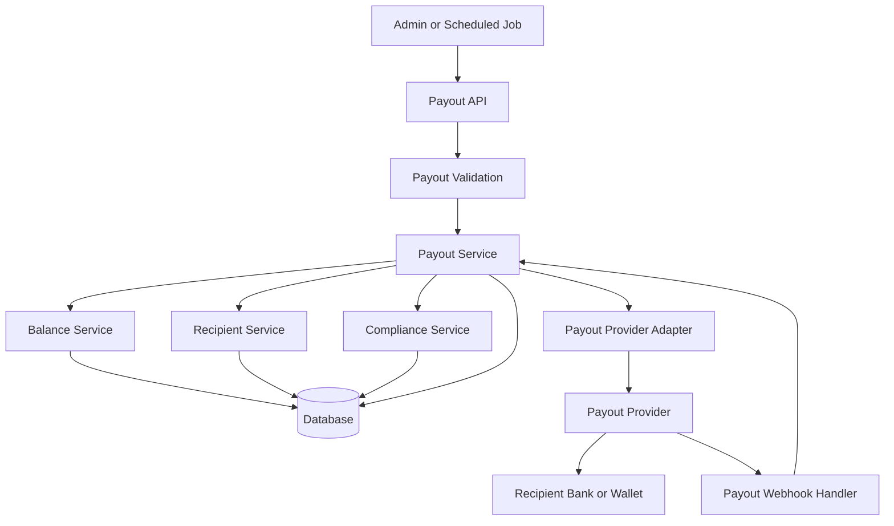
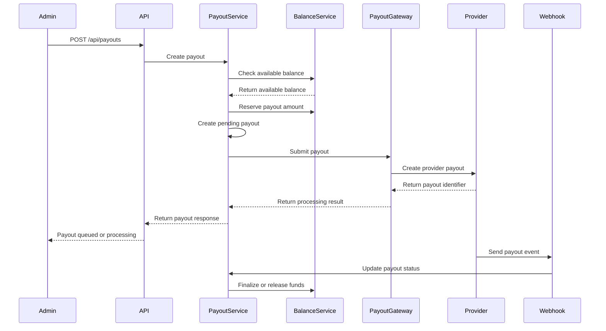

## Payout Architecture

The payout module handles the transfer of available funds from the platform balance to sellers, vendors, creators, or connected accounts.

Unlike customer payments, payouts are outbound transactions. They require separate balance tracking, eligibility checks, provider integration, reconciliation, and failure handling.

> This payout implementation is intended for demonstration purposes. Real fund transfers require a properly configured payout provider and verified recipient accounts.

### Payout Features

* Recipient account management
* Available and pending balance tracking
* Manual and automatic payouts
* Minimum payout threshold
* Payout fee calculation
* Multiple payout methods
* Payout approval workflow
* Idempotent payout requests
* Provider webhook processing
* Failed payout retry support
* Payout cancellation when supported
* Transaction history
* Audit logging
* Reconciliation support

## Payout Technical Architecture



## Payout Architecture Layers

### Payout API Layer

The payout API receives requests from administrators, sellers, internal services, or scheduled payout jobs.

Its responsibilities include:

* Authenticating the requester
* Validating payout requests
* Verifying recipient ownership
* Checking payout permissions
* Preventing duplicate requests
* Calling the payout service
* Returning standardized payout responses
* Protecting sensitive payout endpoints

Example endpoint:

```http
POST /api/payouts
```

Example request:

```json
{
  "recipientId": "recipient_123456",
  "amount": 500000,
  "currency": "USD",
  "method": "bank_transfer",
  "description": "Seller payout for July 2026"
}
```

The requested amount must never be trusted without checking the recipient's available balance on the server.

### Payout Service

The payout service coordinates the complete payout workflow.

Typical workflow:

1. Authenticate the payout requester.
2. Validate the recipient account.
3. Verify payout eligibility.
4. Load the recipient's available balance.
5. Validate the requested amount.
6. Calculate payout fees.
7. Reserve the payout amount.
8. Create a pending payout record.
9. Submit the payout to the provider.
10. Store the provider transaction identifier.
11. Return the payout result.
12. Wait for webhook confirmation when processing is asynchronous.

Provider-specific logic should remain inside the payout gateway adapter.

### Balance Service

The balance service manages funds belonging to each payout recipient.

Recommended balance categories:

```text
PENDING
AVAILABLE
RESERVED
PAID_OUT
REFUNDED
DISPUTED
```

Example recipient balance:

```json
{
  "recipientId": "recipient_123456",
  "currency": "USD",
  "pending": 300000,
  "available": 1500000,
  "reserved": 500000,
  "paidOut": 4200000
}
```

A payout should only use the available balance.

When a payout request is created, the payout amount should move from `AVAILABLE` to `RESERVED`.

When the payout succeeds, the reserved amount should move to `PAID_OUT`.

When the payout fails permanently, the reserved amount should return to `AVAILABLE`.

### Recipient Service

The recipient service manages payout destination information.

A recipient may represent:

* Seller
* Vendor
* Creator
* Marketplace account
* Contractor
* Connected business account

Example recipient:

```json
{
  "id": "recipient_123456",
  "name": "Demo Seller",
  "type": "seller",
  "status": "VERIFIED",
  "defaultPayoutMethodId": "method_123456",
  "currency": "USD"
}
```

Sensitive banking information should not be stored directly unless required.

When possible, store only provider-generated tokens or external account identifiers.

### Compliance Service

The compliance service determines whether a recipient is eligible to receive payouts.

Possible checks include:

* Identity verification status
* Business verification status
* Bank account verification
* Supported country
* Supported currency
* Payout account restrictions
* Sanctions screening
* Risk review status
* Daily and monthly payout limits

Example recipient verification statuses:

```text
UNVERIFIED
PENDING_VERIFICATION
VERIFIED
RESTRICTED
REJECTED
SUSPENDED
```

A recipient must not receive a payout while their account is restricted, rejected, or suspended.

### Payout Fee Calculation

Payout fees must be calculated on the server.

```text
Requested payout amount
- Payout fee
= Recipient receives
```

Example:

```json
{
  "currency": "USD",
  "requestedAmount": 500000,
  "payoutFee": 10000,
  "recipientReceives": 490000
}
```

The platform must clearly define whether the payout fee is:

* Deducted from the requested amount
* Charged separately to the platform
* Included in the recipient's balance calculation

Money values should use integers in the smallest supported currency unit.

## Payout Statuses

Recommended payout statuses:

```text
DRAFT
PENDING_APPROVAL
QUEUED
PROCESSING
SUCCEEDED
FAILED
CANCELLED
REVERSED
```

Suggested status meanings:

| Status             | Description                              |
| ------------------ | ---------------------------------------- |
| `DRAFT`            | Payout record created but not submitted  |
| `PENDING_APPROVAL` | Waiting for administrative approval      |
| `QUEUED`           | Approved and waiting to be processed     |
| `PROCESSING`       | Submitted to the payout provider         |
| `SUCCEEDED`        | Funds successfully sent                  |
| `FAILED`           | Payout could not be completed            |
| `CANCELLED`        | Payout cancelled before completion       |
| `REVERSED`         | Previously completed payout was returned |

The provider status and internal payout status should be stored separately.

Example provider statuses:

```text
PENDING
IN_TRANSIT
PAID
FAILED
CANCELLED
RETURNED
```

## Payout Gateway Adapter

Payout provider integrations should be isolated behind a common interface.

```ts
interface PayoutGateway {
  createRecipient(
    input: CreateRecipientInput
  ): Promise<RecipientResult>;

  createPayout(
    input: CreatePayoutInput
  ): Promise<PayoutResult>;

  getPayoutStatus(
    payoutId: string
  ): Promise<PayoutStatus>;

  cancelPayout(
    payoutId: string
  ): Promise<CancelPayoutResult>;
}
```

Possible implementations:

```text
MockPayoutGateway
StripeConnectPayoutGateway
PayPalPayoutGateway
BankTransferPayoutGateway
```

The payout service should not directly depend on a specific provider.

## Payout Sequence



## Automatic Payouts

Automatic payouts may be processed by a scheduled job.

Example payout schedules:

```text
DAILY
WEEKLY
MONTHLY
MANUAL
```

Recommended scheduled payout workflow:

1. Find verified recipients with automatic payouts enabled.
2. Calculate each recipient's available balance.
3. Check the minimum payout threshold.
4. Apply account limits and compliance rules.
5. Create an idempotent payout request.
6. Reserve the payout amount.
7. Submit the payout to the provider.
8. Record the processing result.
9. Continue processing other recipients when one payout fails.

Example scheduler:

```text
Every day at 02:00 UTC
```

Automatic payout jobs should use distributed locking to prevent multiple workers from creating duplicate payouts.

## Payout Approval Workflow

High-value or high-risk payouts may require manual approval.

Example approval statuses:

```text
NOT_REQUIRED
PENDING
APPROVED
REJECTED
```

Possible approval rules:

* Payout amount exceeds a configured limit.
* Recipient was recently created.
* Recipient changed their bank account.
* Recipient has an elevated risk score.
* Payout is requested outside the normal schedule.
* Account has unresolved disputes or negative balance.

The user approving a payout should not be the same user who modified the payout destination when separation of duties is required.

## Suggested Payout Project Structure

```text
checkout-demo/
├── src/
│   ├── app/
│   │   ├── payouts/
│   │   ├── payout-history/
│   │   ├── payout-settings/
│   │   └── api/
│   │       ├── payouts/
│   │       ├── recipients/
│   │       ├── balances/
│   │       └── webhooks/
│   │           └── payouts/
│   ├── components/
│   │   ├── payout-form/
│   │   ├── payout-summary/
│   │   ├── payout-history/
│   │   ├── balance-card/
│   │   ├── recipient-form/
│   │   └── payout-status/
│   ├── services/
│   │   ├── payout.service.ts
│   │   ├── balance.service.ts
│   │   ├── recipient.service.ts
│   │   ├── compliance.service.ts
│   │   └── reconciliation.service.ts
│   ├── payouts/
│   │   ├── payout-gateway.interface.ts
│   │   ├── mock-payout.gateway.ts
│   │   └── stripe-connect-payout.gateway.ts
│   ├── repositories/
│   │   ├── payout.repository.ts
│   │   ├── balance.repository.ts
│   │   └── recipient.repository.ts
│   ├── jobs/
│   │   ├── automatic-payout.job.ts
│   │   └── payout-reconciliation.job.ts
│   ├── validators/
│   ├── types/
│   └── utils/
```

## Example Payout Response

Successful payout creation:

```json
{
  "success": true,
  "payoutId": "payout_123456",
  "recipientId": "recipient_123456",
  "status": "PROCESSING",
  "amount": 500000,
  "fee": 10000,
  "recipientReceives": 490000,
  "currency": "USD",
  "provider": "mock"
}
```

Failed payout request:

```json
{
  "success": false,
  "error": {
    "code": "INSUFFICIENT_BALANCE",
    "message": "The recipient does not have enough available balance."
  }
}
```

Other recommended error codes:

```text
INVALID_RECIPIENT
RECIPIENT_NOT_VERIFIED
PAYOUT_METHOD_NOT_FOUND
UNSUPPORTED_CURRENCY
AMOUNT_BELOW_MINIMUM
AMOUNT_ABOVE_LIMIT
INSUFFICIENT_BALANCE
PAYOUT_ALREADY_EXISTS
PROVIDER_UNAVAILABLE
PAYOUT_FAILED
```

## Payout Idempotency

Payout requests must support idempotency to prevent duplicate fund transfers.

Example header:

```http
Idempotency-Key: payout-recipient-123456-2026-07
```

The same idempotency key must return the original payout result instead of creating another payout.

The idempotency record should include:

* Idempotency key
* Request hash
* Payout identifier
* Processing status
* Response payload
* Creation time
* Expiration time

## Payout Webhook Handling

Payout provider webhooks should be treated as the trusted source for asynchronous payout updates.

Example endpoint:

```http
POST /api/webhooks/payout
```

Recommended webhook workflow:

1. Receive the payout event.
2. Verify the provider signature.
3. Validate the event type.
4. Check whether the event was already processed.
5. Find the related internal payout.
6. Update the provider payout status.
7. Update the internal payout status.
8. Finalize or release the reserved balance.
9. Record the event for auditing.
10. Return a successful HTTP response.

Example events:

```text
payout.created
payout.processing
payout.paid
payout.failed
payout.cancelled
payout.returned
```

Webhook processing should be idempotent because providers may send the same event multiple times.

## Payout Reconciliation

Reconciliation compares internal payout records with provider records and bank settlement information.

Recommended reconciliation checks:

* Missing provider payouts
* Unknown provider transactions
* Amount mismatches
* Currency mismatches
* Incorrect payout fees
* Stale processing payouts
* Returned payouts
* Duplicate transactions
* Balance inconsistencies

A scheduled reconciliation job should report mismatches without automatically modifying financial records unless the correction process is explicitly designed and audited.

## Payout Environment Variables

Add payout configuration to the environment file:

```env
PAYOUT_PROVIDER=mock
PAYOUT_SECRET_KEY=
PAYOUT_WEBHOOK_SECRET=
PAYOUT_MINIMUM_AMOUNT=100000
PAYOUT_DEFAULT_CURRENCY=USD
PAYOUT_SCHEDULE=manual
PAYOUT_AUTO_APPROVAL_LIMIT=5000000
```

Provider credentials must remain on the server and must never be exposed to the frontend.

## Payout Security Considerations

* Require authentication for every payout endpoint.
* Apply role-based access control.
* Verify recipient ownership.
* Require re-authentication for payout method changes.
* Recheck the available balance inside a database transaction.
* Use row-level locking when reserving funds.
* Use idempotency keys for all payout requests.
* Verify every provider webhook signature.
* Encrypt sensitive recipient information.
* Never log complete bank account details.
* Record all payout actions in an audit log.
* Require approval for high-value payouts.
* Rate-limit payout creation endpoints.
* Detect unusual payout behavior.
* Prevent payouts to restricted recipients.
* Notify recipients when payout details change.
* Separate production and test provider credentials.

## Payout Testing

Important payout scenarios to test:

* Successful manual payout
* Successful automatic payout
* Insufficient available balance
* Recipient not verified
* Missing payout method
* Amount below the minimum threshold
* Amount above the payout limit
* Duplicate payout submission
* Concurrent payout requests
* Provider timeout
* Provider rejection
* Invalid webhook signature
* Duplicate webhook event
* Successful payout confirmation
* Failed payout balance release
* Returned payout
* Payout cancellation
* Manual approval and rejection
* Reconciliation mismatch

## Payout Future Improvements

* Add multiple payout currencies
* Add configurable payout schedules
* Add instant payout support
* Add recipient self-service onboarding
* Add payout method verification
* Add two-factor approval for large payouts
* Add negative balance recovery
* Add reserve and rolling-hold rules
* Add tax and financial reporting
* Add downloadable payout statements
* Add provider failover
* Add payout analytics dashboard
* Add automated reconciliation reports
* Add risk scoring and fraud detection
